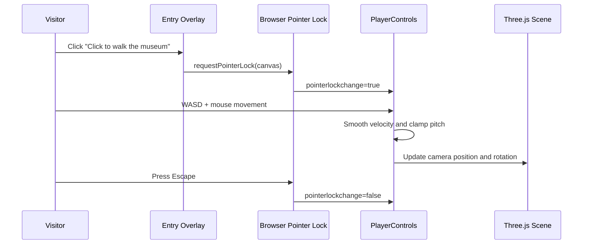

# User Guide

The museum uses first-person navigation intended to feel smooth, grounded, and natural in a browser. Movement is constrained to the square gallery floor plan so visitors can walk around the entire middle partition without clipping through walls.

## Overview

The scene starts with a click-to-enter overlay. Once the visitor clicks, the browser enters pointer lock mode and the mouse controls the camera. Movement uses acceleration smoothing and collision checks so the camera glides naturally instead of snapping from keypresses.

The navigation model is intentionally familiar: the visitor moves like a first-person desktop game, but the speed and damping are tuned for a calm gallery walkthrough rather than an arcade shooter.

## Features

- **Pointer-lock mouse look:** Camera rotation follows the mouse while the cursor is hidden.
- **Keyboard walking:** WASD and arrow keys move the visitor around the room.
- **Sprint modifier:** Shift increases movement speed for faster traversal.
- **Collision boundaries:** Exterior walls and the central divider block movement.
- **Museum-scale camera:** Eye height is fixed at approximately human standing height.
- **HUD controls:** Top overlay shows movement instructions and a docs link.
- **Loopable circulation:** The square room and central partition allow the visitor to walk a full circuit.

## Controls

| Control | Action | Implementation Detail |
|---------|--------|-----------------------|
| Click entry button | Enter pointer lock | Calls `requestPointerLock()` on the canvas |
| W / Arrow Up | Move forward | Forward vector is rotated by current camera yaw |
| S / Arrow Down | Move backward | Uses the same smoothed velocity path |
| A / Arrow Left | Strafe left | Lateral vector is combined with forward movement |
| D / Arrow Right | Strafe right | Supports diagonal movement after normalization |
| Shift | Sprint | Multiplies target movement speed |
| Mouse | Look around | Updates yaw and pitch refs from movement deltas |
| Escape | Exit pointer lock | Browser-native pointer lock release |

## User Guide

### Getting Started

1. Open the museum at `/`.
2. Click **Click to walk the museum**.
3. Move with WASD and look with the mouse.
4. Walk around the center partition to see all six wall surfaces.
5. Press Escape to release the mouse pointer.

### Recommended Walkthrough

| Step | Movement | What to Inspect |
|------|----------|-----------------|
| 1 | Start near the front-left area | Confirm the floor material and room scale |
| 2 | Walk toward the north wall | View the first exterior-wall artwork |
| 3 | Turn right | Follow the east wall and its frame |
| 4 | Circle around the partition end | Inspect the partition-right artwork |
| 5 | Continue toward the south wall | View the front wall frame from a distance |
| 6 | Return on the west side | Inspect the west wall and partition-left frame |

### Tips & Shortcuts

- Start by walking to one end of the middle wall, then loop around it to view all six walls.
- The two central wall surfaces face opposite sides of the gallery.
- If pointer lock does not engage, click the canvas or the center entry button again.
- Step backward from plaques if the in-canvas HTML label is too close to read comfortably.

## Navigation Flow

## Technical Details

### Navigation Logic

`PlayerControls` stores keyboard state and mouse deltas in refs. Each frame calculates an intended velocity, smooths it with exponential damping, rotates movement by the current yaw, and applies wall collision before assigning the camera position.

### Collision Model

The collision system uses simple axis-aligned bounding boxes around:

| Collider | Purpose |
|----------|---------|
| North wall | Blocks forward exit from the room |
| East wall | Blocks right-side exit |
| South wall | Blocks entry-side exit |
| West wall | Blocks left-side exit |
| Center partition wall | Forces visitors to walk around the middle divider |

The player is represented as a circular radius. When a proposed movement intersects a wall box, the system attempts to preserve sliding on either the X or Z axis before falling back to the previous position.

### Camera Feel

| Constant | Value | Reason |
|----------|-------|--------|
| Eye height | `1.65` | Human standing viewpoint |
| Walk speed | `4.2` | Fast enough to traverse the small square room |
| Sprint multiplier | `1.7` | Convenience without breaking realism |
| Mouse sensitivity X | `0.0022` | Smooth horizontal look |
| Mouse sensitivity Y | `0.002` | Slightly softer vertical look |
| Pitch clamp | `-1.2` to `1.2` | Prevents unnatural camera flipping |

## Related Docs

- **[Scene Architecture](/docs)** — Component layout and scene composition
- **[Performance and Navigation](/docs)** — Renderer and movement tuning
