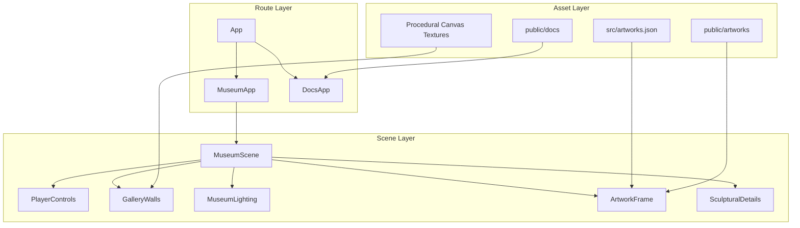
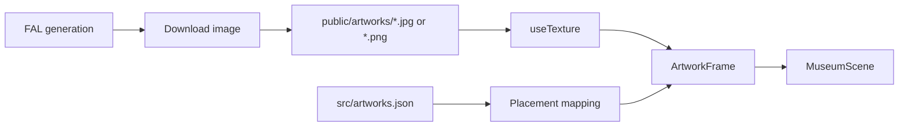

# Scene Architecture

FAL Museum is built as a single React Three Fiber scene with layered responsibilities: player controls, room architecture, lighting, artwork frames, decorative objects, and documentation rendering.

## Overview

The application has two route modes. The root route renders the WebGL museum. The `/docs` route renders markdown files from `public/docs` with a documentation shell modeled after ryOS docs: left navigation, clear section hierarchy, code blocks, tables, diagrams, and related links.

The scene itself is intentionally componentized. Rendering concerns stay in small components, while constants such as room dimensions and collision geometry remain near the top of `src/App.tsx` so the floor plan can be adjusted quickly.

## Architecture Overview



## Component Directory Structure

```text
src/
├── App.tsx          # Scene, controls, artwork placement, docs route
├── App.css          # HUD, labels, docs styling
├── artworks.json    # FAL model metadata and generated image paths
├── main.tsx         # React entry point
└── index.css        # Vite baseline styles

public/
├── artworks/        # Generated FAL images served as static assets
└── docs/            # Markdown docs rendered at /docs
```

## Component Summary

| Component | Layer | Responsibility |
|-----------|-------|----------------|
| `App` | Route | Chooses museum or docs based on `location.pathname` |
| `MuseumApp` | UI shell | Full-screen canvas, HUD, pointer-lock entry overlay |
| `MuseumScene` | 3D composition | Composes lights, room, frames, controls, decor |
| `PlayerControls` | Input | WASD, mouse look, velocity damping, collision |
| `GalleryWalls` | Architecture | Floor, ceiling, outer walls, partition, baseboards |
| `ArtworkFrame` | Exhibit | Frame mesh, artwork texture, plaque, HTML label |
| `MuseumLighting` | Lighting | Ambient, hemisphere, directional, point, and spot lights |
| `SculpturalDetails` | Decor | Primitive sculpture, bench, circular rug/plinth |
| `DocsApp` | Docs | Markdown navigation and article rendering |

## Scene Components

### MuseumApp (`src/App.tsx`)

`MuseumApp` owns the full-screen canvas, pointer-lock entry overlay, top HUD, renderer configuration, and route link to `/docs`.

**Features:**

- Sets up a full-screen canvas
- Tracks pointer-lock state
- Enables shadows and high-performance WebGL settings
- Applies ACES filmic tone mapping for more realistic highlights
- Keeps the entry overlay outside the canvas for reliable click handling

### MuseumScene (`src/App.tsx`)

`MuseumScene` composes the world: fog, soft shadows, lights, walls, frames, sculptures, and first-person controls.

```tsx
<MuseumScene active={locked} />
```

The `active` prop is derived from browser pointer-lock state. Movement only updates when the pointer is locked.

### GalleryWalls (`src/App.tsx`)

`GalleryWalls` creates the physical gallery structure:

- Square wood floor
- White brick ceiling
- Four exterior walls
- One central divider wall
- Warm baseboards along wall edges

### ArtworkFrame (`src/App.tsx`)

`ArtworkFrame` renders one generated image as a museum object. Each frame includes:

- Gold outer frame
- Dark inner mat
- Image plane with the FAL artwork texture
- Physical label plaque
- HTML plaque text rendered in-canvas through Drei `Html`

### DocsApp (`src/App.tsx`)

`DocsApp` renders markdown files from `public/docs` and uses a ryOS-style documentation layout with a left navigation rail and clean article typography.

## Data Flow



## Technical Details

### Artwork Placement

The six placements map directly to the requested wall surfaces:

| ID | Wall Surface | Position Strategy | Rotation |
|----|--------------|-------------------|----------|
| `north` | Exterior north wall | Centered on negative Z wall | Faces inward toward positive Z |
| `east` | Exterior east wall | Mounted on positive X wall | Rotated `-90°` |
| `south` | Exterior south wall | Centered on positive Z wall | Rotated `180°` |
| `west` | Exterior west wall | Mounted on negative X wall | Rotated `90°` |
| `partition-left` | One side of middle wall | Mounted on negative X face of divider | Rotated `-90°` |
| `partition-right` | Opposite side of middle wall | Mounted on positive X face of divider | Rotated `90°` |

### Materials

The gallery uses procedural canvas textures for wall brick, ceiling grain, and wood floor boards. This avoids extra network requests while still giving the scene tactile surface detail.

| Material | Generation Method | Visual Goal |
|----------|-------------------|-------------|
| Floor | Canvas stripes and grain lines | Varied wood planks |
| Wall | Offset brick rectangles and noise | Painted white brick |
| Ceiling | Soft brick/plaster pattern | Diffuse gallery ceiling |
| Frame | Standard material with light metalness | Brushed warm gold |
| Plaque | Warm off-white standard material | Museum wall label card |

### Lighting

The lighting stack combines ambient fill, hemisphere light, directional light, ceiling point lights, and artwork spotlights. The goal is gallery realism without heavy post-processing.

| Light | Purpose |
|-------|---------|
| Ambient light | Prevents hard black shadows |
| Hemisphere light | Adds warm sky/ground color variation |
| Directional light | Provides main shadow structure |
| Point lights | Simulate ceiling bulbs |
| Spotlights | Highlight each artwork like a real gallery picture light |

## Related Docs

- **[FAL Artwork Pipeline](/docs)** — Generated image inventory
- **[Performance and Navigation](/docs)** — Movement and renderer tuning
