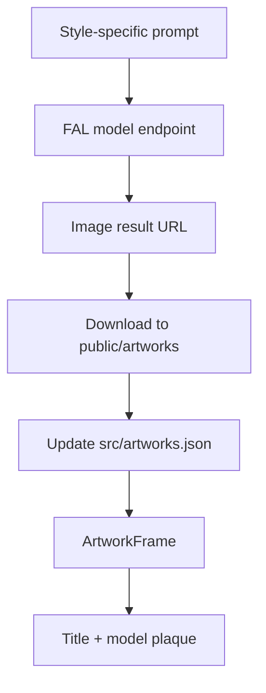

# FAL Artwork Pipeline

The museum includes six generated artworks, one for each wall surface. Each work was produced with FAL, downloaded into the project, and registered in `src/artworks.json` with title, model name, model endpoint, style direction, prompt, and public image path.

## Overview

The art direction intentionally varies by model and style so each wall feels like a distinct room moment while still belonging to one cohesive gallery. The descriptions under each frame use the requested short format: model name plus artwork title.

The final app does not call FAL at runtime. The generated outputs are stored in `public/artworks`, which makes the museum fast, deterministic, and deployable as a static Vite site.

## Features

- **Six unique FAL endpoints:** Each completed wall uses a different FAL model endpoint.
- **Local static assets:** Generated images are downloaded to `public/artworks` for fast loading and reproducible builds.
- **Model metadata:** `src/artworks.json` keeps the model endpoint and display name next to each title.
- **Prompt traceability:** The generation prompt is stored with each artwork.
- **In-scene labels:** Labels render under the frames with model name and artwork title.
- **Runtime-free art loading:** No FAL credentials are required in the browser.

## Artwork Inventory

| Wall Surface | Title | Display Model | Endpoint | Asset |
|--------------|-------|---------------|----------|-------|
| North | Nocturne of Glass Orchards | Stable Diffusion XL | `fal-ai/fast-sdxl` | `/artworks/north.jpg` |
| East | Brutalist Sun Garden | FLUX.1 schnell | `fal-ai/flux/schnell` | `/artworks/east.jpg` |
| South | The Velvet Machine | Recraft V3 | `fal-ai/recraft/v3/text-to-image` | `/artworks/south.jpg` |
| West | Rain Room Sonata | Imagen3 Fast | `fal-ai/imagen3/fast` | `/artworks/west.png` |
| Partition Left | A Map of Quiet Thunder | Ideogram V2A Turbo | `fal-ai/ideogram/v2a/turbo` | `/artworks/partition-left.png` |
| Partition Right | Porcelain Aurora | Flux 2 Flash | `fal-ai/flux-2/flash` | `/artworks/partition-right.png` |

## Generation Flow



## Artwork Details

### North Wall

| Field | Value |
|-------|-------|
| Title | Nocturne of Glass Orchards |
| Model | Stable Diffusion XL |
| Endpoint | `fal-ai/fast-sdxl` |
| Style | Cinematic hyperreal oil painting |

Prompt direction: a moonlit glass orchard inside a misty conservatory with dramatic Rembrandt lighting and deep texture.

### East Wall

| Field | Value |
|-------|-------|
| Title | Brutalist Sun Garden |
| Model | FLUX.1 schnell |
| Endpoint | `fal-ai/flux/schnell` |
| Style | Architectural editorial realism |

Prompt direction: a brutalist concrete garden under a warm artificial sun with moss, water reflections, and editorial camera detail.

### South Wall

| Field | Value |
|-------|-------|
| Title | The Velvet Machine |
| Model | Recraft V3 |
| Endpoint | `fal-ai/recraft/v3/text-to-image` |
| Style | Luxury surreal poster realism |

Prompt direction: a velvet-covered antique machine blooming with white lilies, lit as a museum object.

### West Wall

| Field | Value |
|-------|-------|
| Title | Rain Room Sonata |
| Model | Imagen3 Fast |
| Endpoint | `fal-ai/imagen3/fast` |
| Style | Soft photoreal cinematic |

Prompt direction: a quiet room made of rain and floating piano strings with silver reflections.

### Partition Left

| Field | Value |
|-------|-------|
| Title | A Map of Quiet Thunder |
| Model | Ideogram V2A Turbo |
| Endpoint | `fal-ai/ideogram/v2a/turbo` |
| Style | Graphic surreal realism |

Prompt direction: a topographic map made from quiet thunderclouds and brass contour lines, with no letters or words.

### Partition Right

| Field | Value |
|-------|-------|
| Title | Porcelain Aurora |
| Model | Flux 2 Flash |
| Endpoint | `fal-ai/flux-2/flash` |
| Style | Dreamlike gallery realism |

Prompt direction: porcelain mountains under a green aurora with glossy ceramic textures.

## Technical Details

### Data Shape

```typescript
type Artwork = {
  id: string
  title: string
  model: string
  modelName: string
  style: string
  src: string
  prompt: string
}
```

### Runtime Asset Loading

Artwork planes use `useTexture(art.src)` from Drei. Textures are marked as `SRGBColorSpace` so generated images display with correct color in the ACES-tonemapped scene.

### Why Assets Are Static

| Choice | Benefit |
|--------|---------|
| Download images into `public/artworks` | Faster first paint and no runtime API dependency |
| Store prompt/model in JSON | Keeps generation provenance visible |
| Render labels from metadata | Avoids hard-coded duplicate label text |
| Avoid browser FAL calls | Keeps credentials off the client |

### Updating Artworks

To replace a work:

1. Generate a new FAL image.
2. Save it to `public/artworks/<id>.<ext>`.
3. Update the matching item in `src/artworks.json`.
4. Keep the title and model metadata concise enough for the label plaque.
5. Run `npm run build` to verify the JSON, assets, and TypeScript compile.

## Related Docs

- **[Scene Architecture](/docs)** — How artworks are placed into the scene
- **[Overview](/docs)** — Museum layout and route summary
