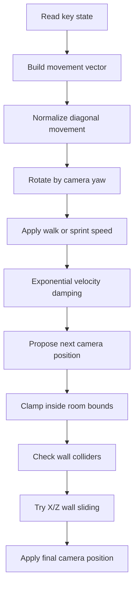

# Performance and Navigation

Performance is tuned around a fast, realistic browser walkthrough instead of a heavy cinematic renderer. The museum uses real-time shadows and rich materials, but avoids expensive post-processing, high-poly imported assets, or unnecessary physics simulation.

## Overview

The scene should feel responsive on a normal laptop browser. The app uses React Three Fiber for declarative structure while keeping frame-by-frame movement logic in refs to avoid React state churn.

The main performance strategy is to spend detail where the visitor notices it most: material texture, picture lighting, and camera motion. The project avoids large imported GLTF assets and expensive global effects that would add weight without improving the walkthrough as much.

## Features

- **Bounded device pixel ratio:** Canvas DPR is limited to `[1, 1.75]` to protect frame rate on high-density displays.
- **Procedural material textures:** Floor, wall, and ceiling textures are generated in-browser once with canvas textures.
- **Simple collision math:** Axis-aligned wall boxes provide reliable collision without a full physics engine.
- **Lightweight decor:** Sculptural and bench details use primitive geometry instead of large GLTF files.
- **Preloaded image assets:** Drei `Preload` warms scene resources after mount.
- **No heavy post-processing:** ACES tone mapping gives a realistic feel without bloom, SSAO, or screen-space reflections.
- **Ref-based controls:** Input and velocity state stay outside React render state for smooth frame updates.

## Performance Budget

| Area | Strategy | Why It Helps |
|------|----------|--------------|
| Rendering resolution | `dpr={[1, 1.75]}` | Avoids excessive pixel cost on Retina screens |
| Materials | Canvas textures | Visual detail without extra image downloads |
| Geometry | Boxes, planes, primitive sculptures | Low vertex count and quick startup |
| Lighting | A few targeted lights | Gallery realism without post-processing stack |
| Navigation | Direct math instead of physics engine | Predictable movement and smaller bundle |
| Art assets | Static local files | No runtime FAL latency |
| Docs route | Plain markdown fetch | Keeps docs simple and cacheable |

## User Guide

### Smooth Movement

Movement uses velocity damping, not direct position jumps. This makes starts and stops feel more like a person walking through a room.

### Wall Sliding

When the player intersects a wall, the collision function tries to preserve one axis of movement. This produces natural sliding along walls instead of freezing abruptly.

### Browser Notes

- Pointer lock requires a user click.
- Pressing Escape releases the pointer.
- The Docs route is normal HTML and does not keep the WebGL scene mounted.
- If the browser is under heavy load, lower the DPR cap or simplify shadows first.

## Navigation Constants

| Constant | Value | Description |
|----------|-------|-------------|
| `ROOM` | `15` | Square room width/depth |
| `HALF` | `7.5` | Half room size for wall positioning |
| `WALL_HEIGHT` | `4.2` | Gallery wall height |
| `WALL_THICKNESS` | `0.28` | Physical wall depth for collision/visual mass |
| `PLAYER_RADIUS` | `0.36` | Collision radius around the visitor |
| Camera Y | `1.65` | Standing eye height |

## Navigation Algorithm



## Technical Details

### Renderer Settings

```tsx
<Canvas
  shadows
  dpr={[1, 1.75]}
  camera={{ fov: 67, near: .05, far: 70 }}
  gl={{ antialias: true, powerPreference: 'high-performance' }}
/>
```

### Realism Choices

The gallery realism comes from many small details rather than one expensive effect:

| Detail | Implementation | Visual Purpose |
|--------|----------------|----------------|
| Picture lights | Spotlights aimed at each frame | Makes every artwork feel curated |
| Wall texture | Procedural white brick | Avoids flat CG walls |
| Floor texture | Procedural wood planks | Adds scale and movement parallax |
| Baseboards | Thin box meshes | Grounds the wall/floor intersection |
| Fog | Three.js scene fog | Adds distance depth in the compact room |
| Human eye height | Fixed camera Y | Makes scale believable |
| Plaques | Drei `Html` labels on physical cards | Browser-crisp text inside the gallery |
| Gold frames | Box meshes around art planes | Physical museum object feel |

### Collision Details

`clampWalkPosition` first clamps the visitor to the square room boundaries. It then tests the proposed camera position against each wall collider. If the position intersects a wall, it tries two alternatives:

1. Preserve the new X movement but revert Z.
2. Preserve the new Z movement but revert X.

This gives a natural wall-slide feel. If both alternatives still collide, the camera returns to the previous position.

## Verification

| Check | Expected Result |
|-------|-----------------|
| `/` loads | Canvas appears with HUD and entry overlay |
| Entry click | Pointer lock becomes active |
| WASD movement | Camera moves smoothly |
| Mouse movement | Camera yaw/pitch updates naturally |
| Collision | User cannot pass through exterior walls or divider |
| Full circulation | User can walk around both ends of the center wall |
| Art labels | Six plaques display titles and model names |
| `/docs` route | Documentation shell and markdown render correctly |
| `npm run build` | TypeScript and Vite build succeed |

## Related Docs

- **[User Guide](/docs)** — Controls and walkthrough flow
- **[Scene Architecture](/docs)** — Component relationships and rendering structure
